# Exercise 01: Create an SAP account and configure SAP resources

In this exercise, you'll create an SAP account. You'll also create an account so that you can access the SAP Gateway Demo system. The Gateway Demo system serves as the SAP data source for this lab.

## Objectives

After you complete this exercise, you'll be able to:

- Create an SAP account.
- Configure access to the SAP Gateway Demo system.

## Duration

**Estimated time**: 10-15 minutes

===

# Task 01: Create an SAP account

## Introduction

SAP controls access to demos and documentation. You need to create an account before you can access the SAP Gateway Demo system data.

## Description

In this task, you create an account so that you can access SAP resources.

## Success criteria

- You receive an email from SAP that includes the URI and credentials to access the SAP Gateway Demo system.
- You successfully connect to the AP Gateway Demo system.

## Learning resources

- [SAP Home page](https://www.sap.com/index.html "SAP Home page")

## Key tasks

1. [] Sign in to the @lab.VirtualMachine(Base23C).SelectLink virtual machine by using the following credentials:

   - Username: +++Admin+++
   - Password: +++@lab.VirtualMachine(Base23C).Password+++

2. [] Open Edge and go to `https://www.sap.com`.

3. [] At the upper right of the page, select the Sign in icon.

    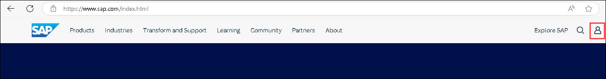

    > [!NOTE]
    > If the **Sign in** icon is not visible, select the **&#9776;** icon to reveal the hidden options.

    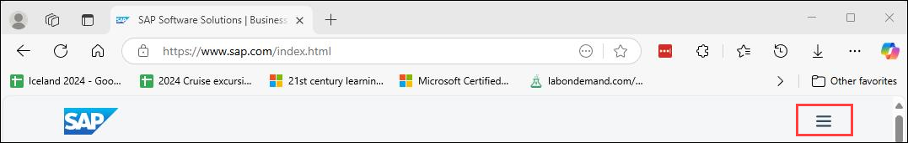

4. [] In the **Login or create an SAP account** dialog, select **Create your SAP account**.

    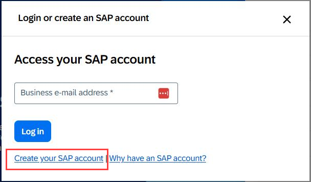

5. [] Enter the following information on the **Register** page of the **We see you're new to SAP** dialog:

	| Field | Value |
	|:---------|:------|
    | First name| `Admin` |
    |Last name |`User`   |
    | Country/Region   | Select your country/region   |
    | Business e-mail address   | Enter your work or personal email address   |
    | Company  | `Contoso`   |
    | Department   | **Training**   |
    | Relationship to SAP  | **Student**   |

6. [] Select the **I have read and understood the Terms and Conditions of SAP.com** checkbox and then select **Submit**.

    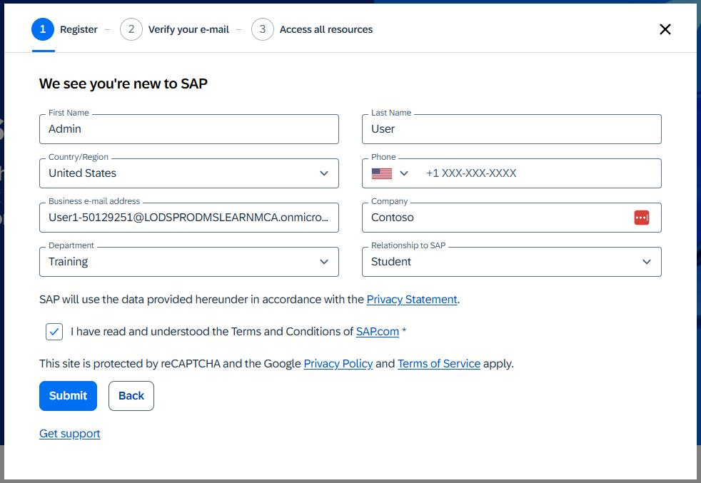

7. [] If prompted, complete the Captcha process.

8. [] Wait for the **Verify your e-mail** page of the **We see you're new to SAP** dialog to display.

    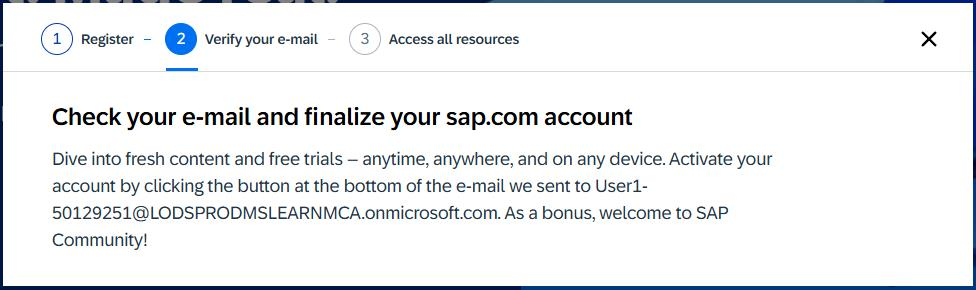

9. [] Open your email app and go to the inbox. Locate an email from the sender **SAP Universal ID - Notification**.

    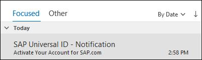

10. [] Open the email. Locate the hyperlink below the **Click to activate your account** button.

    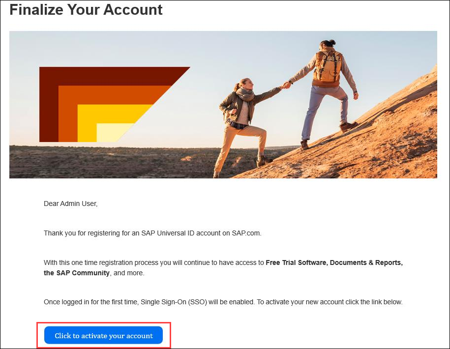

11. [] Copy the link and then paste the link into the following textbox:

    SAP Account activation link: @lab.TextBox(SAPActivationLink)

    > [!WARNING]
    > After pasting the value into the text field, select the **Tab** key or select any element outside of the text field. This ensures that the value is saved for use later in the lab.

12. [] Return to the lab environment. Open a new browser window and go to `@lab.Variable(SAPActivationLink)`.

13. [] In the **Finalize your account** dialog, enter the following values:

    - Password: `@lab.CloudPortalCredential(User1).Password`
    - Re-Enter Password: `@lab.CloudPortalCredential(User1).Password`

14. [] Select the **I acknowledge that I have read the SAP Universal ID Terms of Use** checkbox and then select **Submit**.

    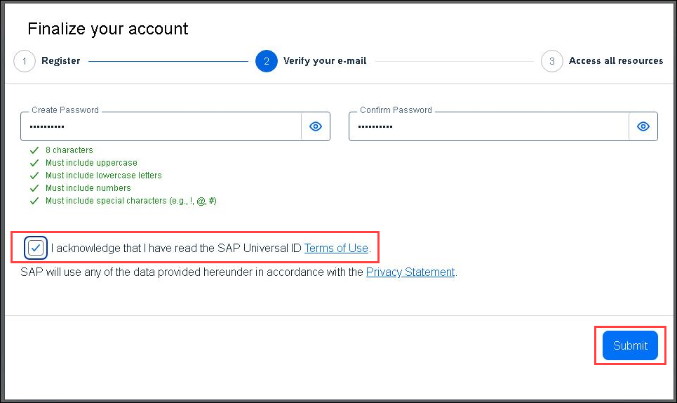

15. [] On the **SAP ID Service** Sign in page, enter the following email address and then select **Continue**:

    Username: `@lab.CloudPortalCredential(User1).Username`

    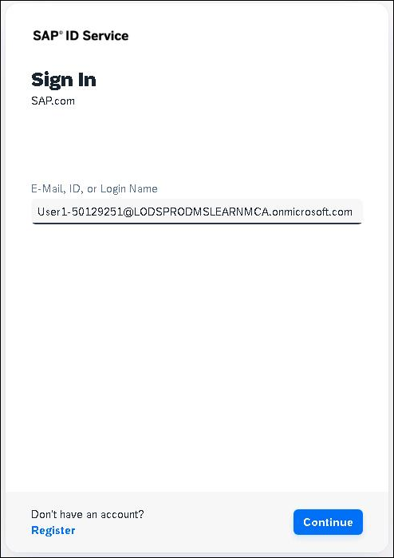

16. [] Wait for the **Thank you!** page to display.

    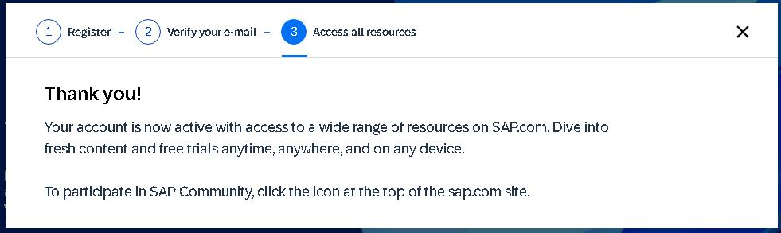

17. [] Close the **Thank you** dialog.

===

# Task 02: Create an account for the SAP Gateway Demo system

## Introduction

Now that you can access SAP resources, you must create an account to access demo data.

## Description

In this task, you sign in to the SAP developer site and create an account. The account provides access to the SAP Gateway Demo system.

## Success criteria

- You have valid credentials to use the SAP Gateway demo system

## Learning resources

- [Create an account on the SAP Gateway Demo system](https://developers.sap.com/tutorials/gateway-demo-signup..html "SAP Gateway Demo system")

## Key tasks

1. [] Open a new browser window and go to `https://register.sapdevcenter.com/SUPSignForms/`.

2. [] If prompted, sign in by using the credentials you used in Task 01 to create your SAP account.

3. [] On the **SAP Gateway Demo Server -ES5** page that displays, copy the User ID value to the Windows clipboard. Paste the value in the following text field:

    User ID: @lab.TextBox(ES5UserID)

4. [] On the **SAP Gateway Demo Server -ES5** page, select the **I have read and understood the Terms and Conditions** checkbox and then select **Register**.

    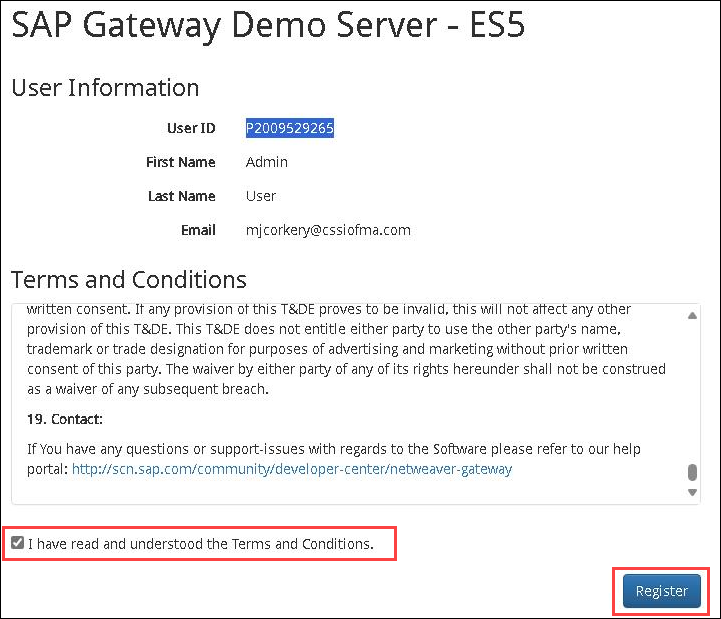

5. [] You should see a new page display. The page will report that the registration is being processed.

6. [] Select **Show password**. Paste the temporary password into the following text field:

    Temporary Password: @lab.TextBox(ES5TemPW)

    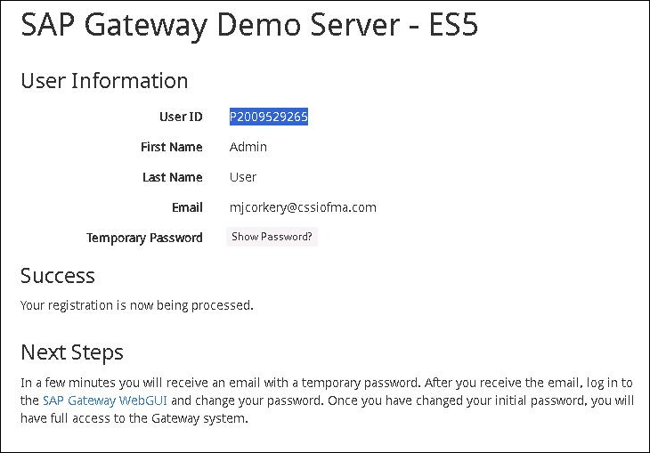

    > [!NOTE]
    > The SAP system will send you an email that includes the Server URI, username, and initial password.

7. [] Open a new browser window and go to `https://sapes5.sapdevcenter.com/sap/bc/gui/sap/its/webgui`

8. [] On the **SAP NetWeaver** page that opens, enter the following credentials and then select **Log on**:

    Username: +++@lab.Variable(ES5UserID)+++
    Password: +++@lab.Variable(ES5TemPW)+++

    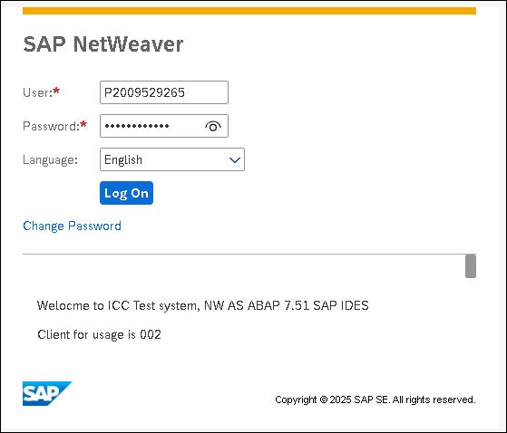

9. [] On the **SAP NetWeaver** page that displays, enter the following information to replace the temporary password and then select **Change**:

    Current Password: `@lab.Variable(ES5TemPW)`
    New Password: `@lab.CloudPortalCredential(User1).Password`
    Repeat Password: `@lab.CloudPortalCredential(User1).Password`

    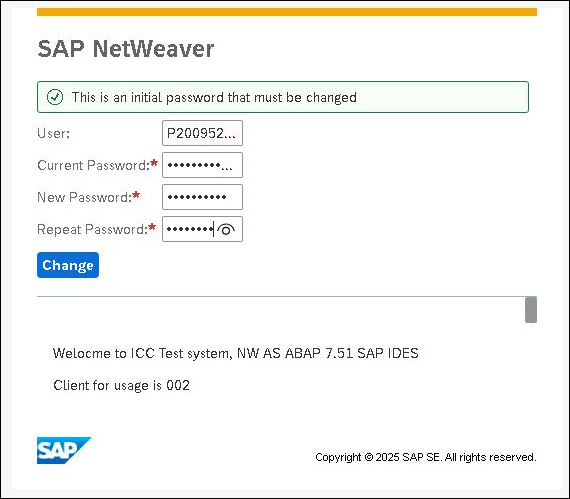

10. [] On the SAP NetWeaver page that displays, verify that the password was changed successfully and then select **Continue**.

    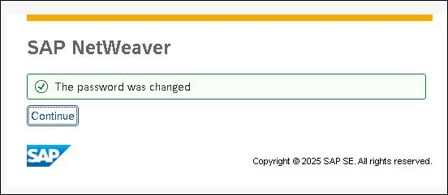

===

# Task 03: Save the SAP Gateway Demo API metadata

## Introduction

In this task, you download the SAP Gateway Demo API metadata file. The metadata file is used in later exercises to create an API connection to the SAP Gateway Demo system.

## Description

In this task, copy the SAP Gateway Demo API metadata, transform it into the OpenAPI format, and then save it to a file. This file is used in later exercises to create an API connection to the SAP Gateway Demo system.

## Success criteria

- You have a local copy of the SAP Gateway Demo API metadata file.

## Key tasks

1. [] Open a new browser window and go to `https://sapes5.sapdevcenter.com/sap/opu/odata/iwbep/GWSAMPLE_BASIC/$metadata`. When prompted, enter the following credentials and then select **Log on**:

    Username: +++@lab.Variable(ES5UserID)+++
    Password: +++@lab.CloudPortalCredential(User1).Password+++

    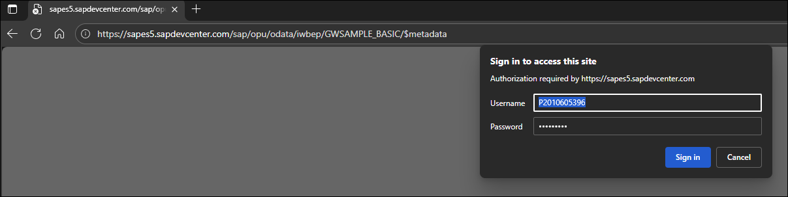

    After you sign in, the SAP Gateway Demo API metadata displays in XML format:

    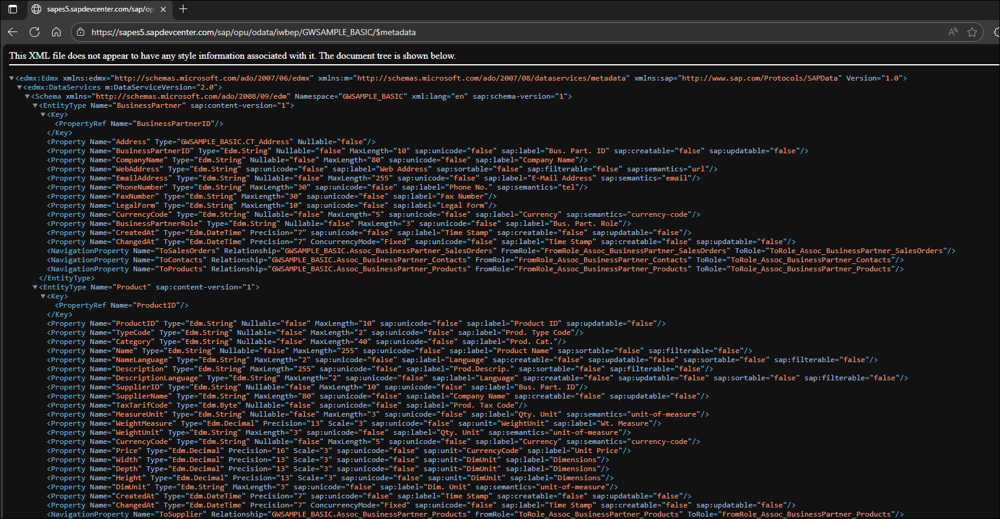

2. [] Select all of the text in the browser window and then copy it to the Windows clipboard.

3. [] In a new browser window, go to `https://convert.odata-openapi.net/`. Paste the XML text into the **Manual Input of OData Definition (XML)** text box.

    > [!WARNING]
    > If there is any non-XML text in the text box, delete it.

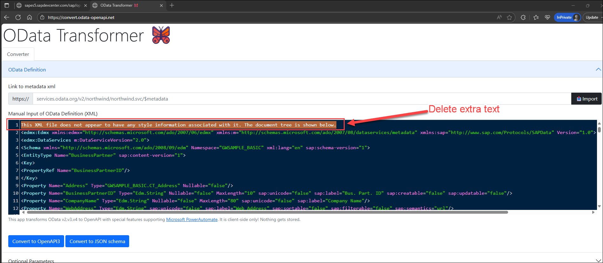

4. [] Select the **Convert to OpenAPI3** button, then select **Download** to download the OpenAPI file.

    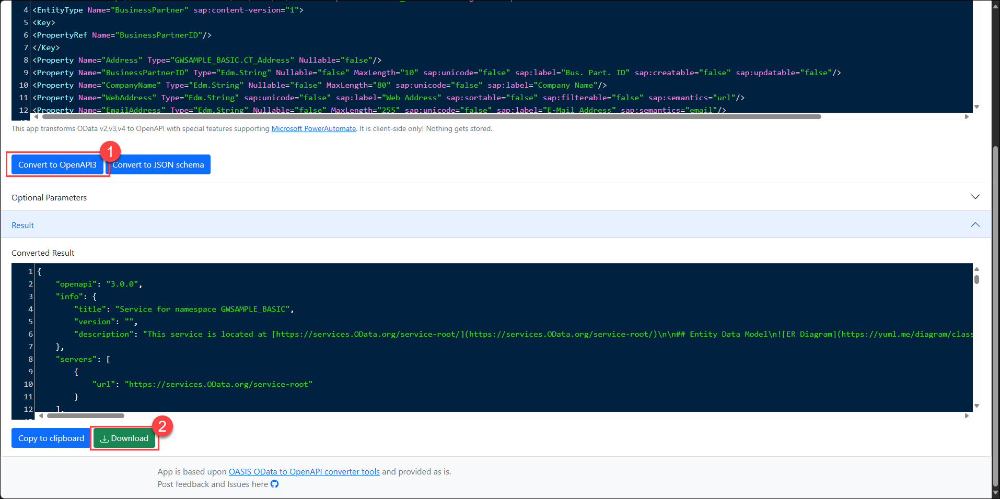

5. [] Make note of the location where the file is saved. You use this file in later exercises.

    > [!NOTE]
    > The file is named `openapi-spec.json` by default. You can rename the file if you want.
