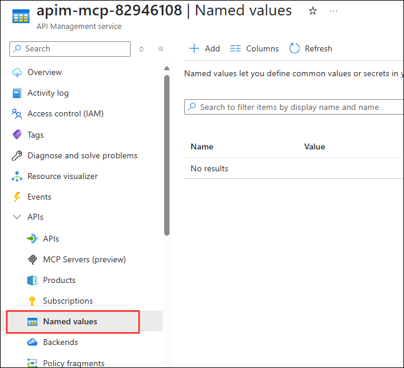
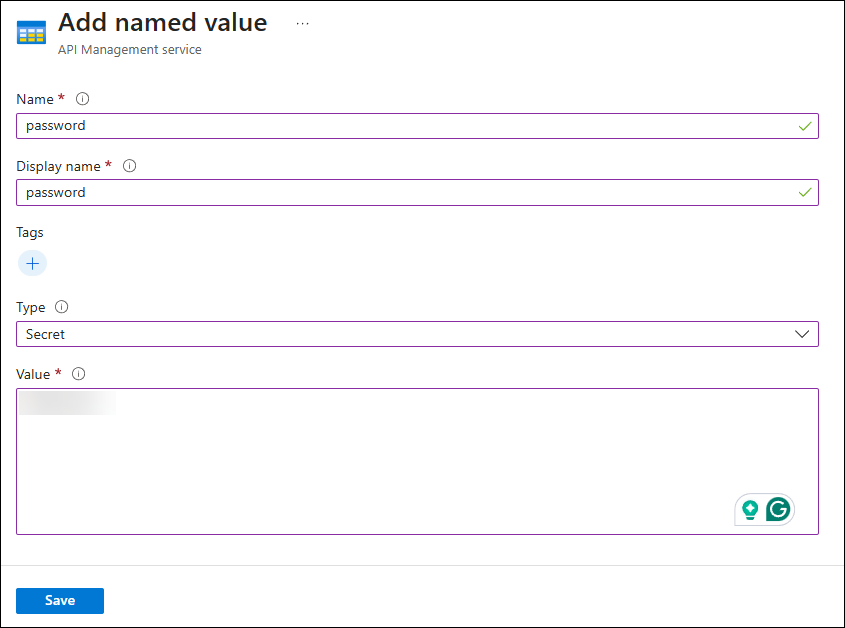

# Exercise 02: Configure SAP API in Azure API Management

In this exercise, you will configure an SAP API in Azure API Management (APIM) to enable secure and efficient access to SAP services. You'll' create an API in APIM that connects to the demo SAP gateway, allowing you to manage and expose SAP functionalities through a modern API interface. These endpoints will be used in the subsequent exercises for creating the MCP server tools.

## Objectives

After you complete this exercise, you will be able to:

- Create and configure an API in Azure API Management using an OpenAPI specification.
- Set up authentication and security for the SAP API.
- Test the configured API to ensure it works correctly.

## Duration

**Estimated time**: 30 minutes

===

# Task 01: Create an API in Azure API Management

## Introduction

Before you can use the MCP server feature in APIM, you need to create an API that connects to the SAP services. This task will guide you through the process of creating an API in Azure API Management using the OpenAPI specification file provided by SAP.

## Description

In this task, you will create an API in Azure API Management using the OpenAPI specification file provided by SAP. This file describes the available endpoints and operations for the SAP services you want to expose.

## Success criteria

- An API is created in Azure API Management using the provided OpenAPI specification file.
- The API is configured with the necessary settings, including the web service URL.

## Learning resources

- [Create and publish an API in Azure API Management](https://learn.microsoft.com/azure/api-management/import-api-from-oas)

## Key tasks

1. [] Open a new browser tab and go to `portal.azure.com`.

2. [] Navigate to your Azure API Management instance that was provisioned for you within your lab instance. To locate it, open your resource group named **@lab.CloudResourceGroup(ResourceGroup1).Name**, then open the API Management instance. Its name will start with `apim-mcp-`, followed by your unique lab identifier.

    

3. [] In the left-hand menu, under the **APIs** section, select **+ Add API**. Select the **OpenAPI** option from the list of available API types.

    

4. [] In the **Create from OpenAPI specification** pane, select the **Select a file** button to upload the OpenAPI specification file you downloaded earlier from the SAP API Business Hub. This file is named `openapi-spec.json`.

    

5. [] After selecting the file, the fields in the pane will be automatically populated based on the contents of the OpenAPI specification file. Update the fields with the following values:

    - **Display name**: `SAP`
    - **Name**: `sap`
    - **API URL suffix**: `SAP`.

    

6. [] Select **Create** to create the API.

7. [] After the API is created, you will be taken to the API's design page. Select the **Settings** tab.

    

8. [] In the **Settings** tab, scroll down to the **Web service URL** field and enter the following URL: `https://sapes5.sapdevcenter.com/sap/opu/odata/iwbep/GWSAMPLE_BASIC`. This is the base URL for the SAP Demo API.

    

9. [] Leave all other settings at their default values. Scroll to the top of the page and select **Save** to save your changes.

# Task 02: Create named values for authentication

## Introduction

The SAP API requires authentication to access its resources. If you were to attempt testing the API now, you would receive a 401 Unauthorized error. To authenticate, you will use named values in Azure API Management to securely store your SAP demo credentials.

## Description

Named values in Azure API Management allow you to store sensitive information, such as API keys and passwords, securely. In this task, you will create named values for your SAP demo credentials.

## Success criteria

- Named values are created in Azure API Management to store your SAP demo credentials securely.

## Learning resources

- [Use named values in Azure API Management](https://learn.microsoft.com/azure/api-management/api-management-howto-properties?tabs=azure-portal#use-a-named-value)

## Key tasks

1. [] In the left-hand menu of your Azure API Management instance, select **Named values** under the **APIs** section.

    

2. [] Select **+ Add** to create a new named value.

    

3. [] In the **Add named value** pane, enter the following details for your SAP demo username:

   - **Name**: `username`
   - **Display name**: `username`
   - **Type**: `Plain`
   - **Value**: `<your-sap-username>`

   

4. [] Select **Save** to create the named value.

5. [] Repeat steps 2-4 to create another named value for your SAP demo password with the following details:

   - **Name**: `password`
   - **Display name**: `password`
   - **Type**: `Secret`
   - **Value**: `<your-sap-password>`

   

6. [] Select **Save** to create the named value.

# Task 03: Configure inbound policy for authentication

## Introduction

To authenticate requests to the SAP API, you need to configure an inbound policy in Azure API Management that adds the necessary authentication headers using the named values you created in the previous task.

## Description

Inbound policies in Azure API Management allow you to modify incoming requests before they are forwarded to the backend service. In this task, you will configure an inbound policy to add the `Authorization` header required by the SAP API.

## Success criteria

- An inbound policy is configured in Azure API Management to add the `Authorization` header using the named values for your SAP demo credentials.

## Learning resources

- [Inbound processing policies in Azure API Management](https://learn.microsoft.com/azure/api-management/api-management-policies#inbound-processing)

## Key tasks

1. [] In the left-hand menu of your Azure API Management instance, select **APIs** under the **APIs** section. Select your **SAP** API from the list.

    

2. [] In the **Design** tab of your SAP API, scroll down to the **Inbound processing** section and select the **base** policy.

    

3. [] In the policy editor, enter the following policy to add the `authentication-basic` node using the named values you created earlier. This will set the `Authorization` header for incoming requests:

    > [!NOTE]
    > Make sure to replace the existing `<inbound>` section with the following code snippet.

    ```xml
    <inbound>
        <base />
        <authentication-basic username="{{username}}" password="{{password}}" />
    </inbound>
    ```

    

4. [] Select **Save** to save your changes.

# Task 04: Test the SAP API

## Introduction

Now that you have created and configured the SAP API in Azure API Management, you can test it to ensure it is working correctly. You will use the built-in test console in the Azure portal to make requests to the API.

## Description

In this task, you will test the SAP API by making requests to its endpoints using the test console in Azure API Management. You will verify that the API is functioning correctly and that you can access the SAP services.

## Success criteria

- You can successfully make requests to the SAP API endpoints and receive valid responses.
- The API is functioning correctly and can access the SAP services.
- You can see the data returned from the SAP API in the test console.
- You do not receive any authentication errors when making requests to the API.

## Learning resources

- [Test an API in Azure API Management](https://learn.microsoft.com/azure/api-management/import-api-from-oas?tabs=portal#test-the-new-api-in-the-portal)

## Key tasks

1. [] In the left-hand menu of your Azure API Management instance, select **APIs** under the **APIs** section. Select your **SAP** API from the list.

    

2. [] In the **Test** tab, select the **Get entities from ProductSet** operation to test.

    

3. [] In the **Parameters** section, set the `$top` parameter to `5` to limit the number of results returned, then select **Send** to make the request.

    > [!WARNING]
    > The SAP API can return a large amount of data, which may cause the test console to time out or fail. Limiting the results with the `$top` parameter helps prevent this issue.

    

4. [] After a few moments, you should see a successful response with a status code of `200 OK` and the data returned from the SAP API.

    
