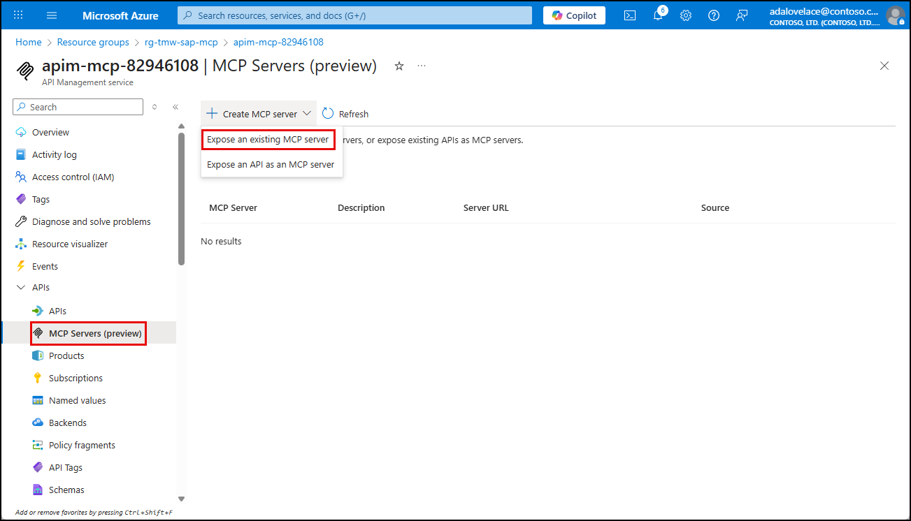
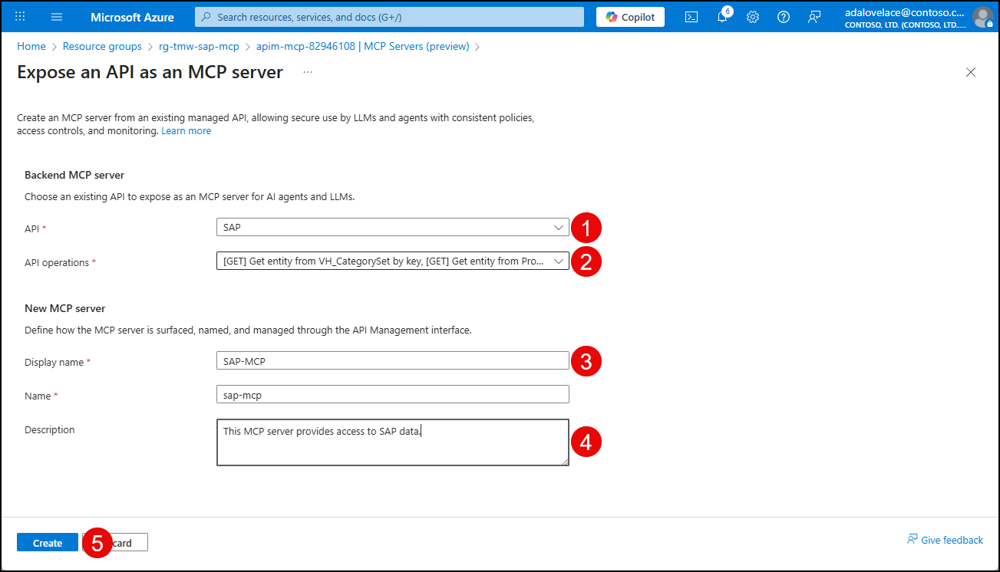

# Exercise 03: Create MCP server from API in Azure API Management

In this exercise, you will use expose the SAP API you created in the previous exercise as an MCP server, and select a handful of the API's endpoints to expose as tools.

## Objectives

After you complete this exercise, you will be able to:

- Expose an existing API in Azure API Management as an MCP server.
- Expose API operations as tools that MCP clients can call.

## Duration

**Estimated time**: 10 minutes

===

# Task 01: Expose an existing API as an MCP server in Azure API Management

## Introduction

Azure API Management (APIM) allows you to expose REST APIs managed in APIM as remote Model Context Protocol (MCP) servers using its built-in AI gateway. Expose one or more of the API operations as tools that MCP clients can call using the MCP protocol.

## Description

In this task, you will create an API in Azure API Management using the OpenAPI specification file provided by SAP. This file describes the available endpoints and operations for the SAP services you want to expose.

## Success criteria

- The SAP API is exposed as an MCP server.
- Select API endpoints are exposes as tools.

## Learning resources

- [About MCP servers in Azure API Management](https://learn.microsoft.com/azure/api-management/mcp-server-overview)
- [Expose REST API in API Management as an MCP server](https://learn.microsoft.com/azure/api-management/export-rest-mcp-server)

## Key tasks

1. [] Open a new web browser tab and go to `portal.azure.com`.

2. [] Navigate to your Azure API Management instance.

3. [] In the left menu, expand **APIs**, select **MCP Servers**, then select **Create MCP Server** > **Expose an API as an MCP server**.

    

4. [] In the **Expose an API as an MCP server** dialog:

   1. [] Select **SAP** from the **API** dropdown list.

   2. [] In the **API Operations** dropdown list, enter **GET** into the search filter, then select the following endpoints to expose as tools:

      - [] `[GET] Get entities from ProductSet`
      - [] `[GET] Get entities from SalesOrderSet`
      - [] `[GET] Get entity from ProductSet by key`
      - [] `[GET] Get entity from SalesOrderLineItemSet by key`
      - [] `[GET] Get entity from SalesOrderSet by key`
      - [] `[GET] Get entity from VH_CategorySet by key`

   3. [] Enter "SAP-MCP" for the new MCP server's **Display name**. Note, this will automatically populate the **Name** field, which you can leave as is.

   4. [] Optionally, enter a description for the MCP server, such as "This MCP Server provides access to SAP data."

   5. [] Select **Create**.

    
