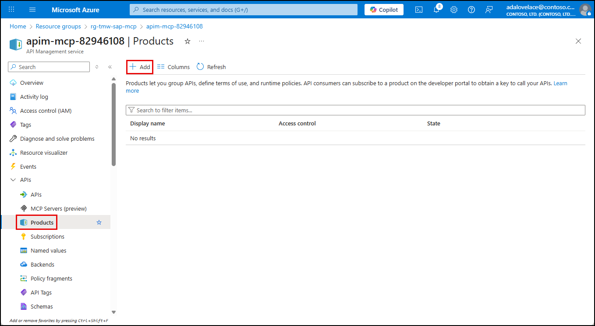
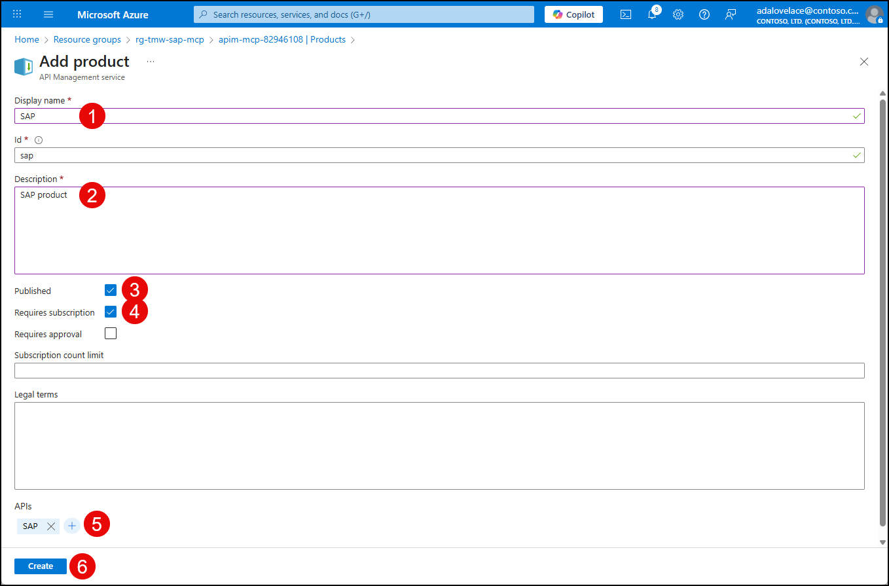
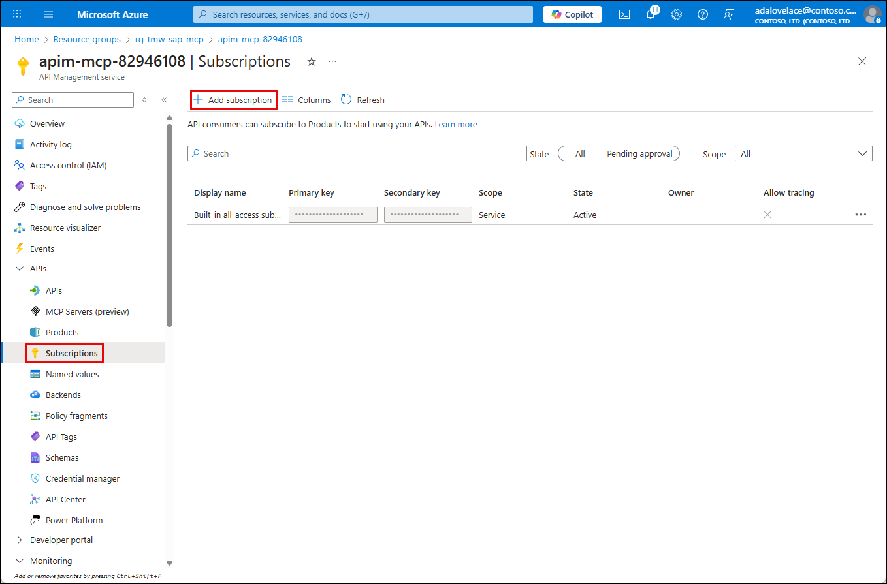
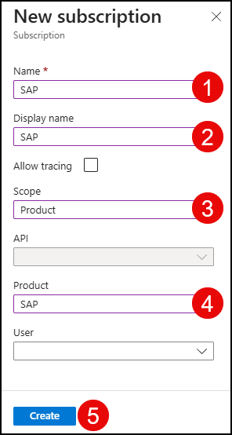

# Exercise 04: Secure Access to your MCP server

In this exercise, you will secure inbound access to your MCP server managed in API Management (APIM) using key-based authentication.

## Objectives

After you complete this exercise, you will be able to:

- Create a product in APIM.
- Create a subscription scoped to an API and Product.
- Use key-based authentication to secure an MCP server.

## Duration

**Estimated time**: 10 minutes

===

# Task 01: Create and publish a product in API Management

## Introduction

In Azure API Management, a product is a bundle of one or more APIs offered to a targeted group of consumers with defined usage quotas, access credentials, and terms of use. Once published, products enable developers to subscribe and begin using the associated APIs.

## Description

In this task, you will use the Azure portal to create and publish a new product for your SAP API in API Management.

## Success criteria

- A product named SAP has been created.
- The product is published.

## Learning resources

- [Create and publish a product](https://learn.microsoft.com/azure/api-management/api-management-howto-add-products)

## Key tasks

1. [] Open a new web browser tab and go to `portal.azure.com`.

2. [] Navigate to your Azure API Management instance.

3. [] In the left menu, expand **APIs**, select **Products**, and select **Add**.

    

4. [] On the **Add product** dialog, enter the following:

    - [] For the **Display name**, enter "SAP." Note, this will set the **Id** property as well.
    - [] Enter "SAP product" for the **Description**.
    - [] Check the box next to **Published**.
    - [] Ensure the **Requires subscription** box is checked.
    - [] Under **APIs**, select `+` and choose the **SAP** API from the list.
    - [] Select **Create**.

    

===

# Task 02: Create a subscription in API Management

## Introduction

In Azure API Management, subscriptions offer a secure and consistent way for API consumers to access published APIs. Each subscription issues a unique key, which client applications must include in the `Ocp-Apim-Subscription-Key` header of their HTTP requests to authenticate and invoke the APIs. Access can be further restricted by scoping APIs to a specific product, ensuring that only the APIs bundled within that product are accessible using the associated subscription key. This model streamlines access control and reinforces security by limiting exposure to authorized users.

## Description

In this task, you will create a new subcription in API Management that is scoped to the SAP Product you created previously.

## Success criteria

- A subscription scoped to a product has been created.

## Learning resources

- [Subscriptions in Azure API Management](https://learn.microsoft.com/azure/api-management/api-management-subscriptions)
- [Create subscriptions in Azure API Management](https://learn.microsoft.com/azure/api-management/api-management-howto-create-subscriptions)

## Key tasks

1. [] Open a new web browser tab and go to `portal.azure.com`.

2. [] Navigate to your Azure API Management instance.

3. [] In the left menu, expand **APIs**, select **Subscriptions**, and select **Add subscription**.

    

4. [] In the **New subscription** pane, enter the following:

    - [] Enter "SAP" into the **Name** field.
    - [] Enter "SAP" into the **Display Name** field.
    - [] Select "Product" for the **Scope**.
    - [] Select "SAP" for the **Product**.
    - [] Select **Create**.

    
