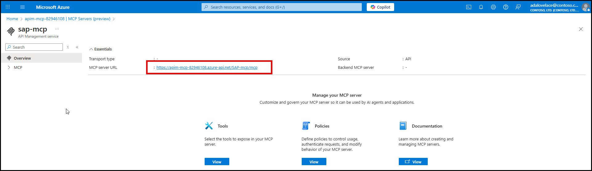
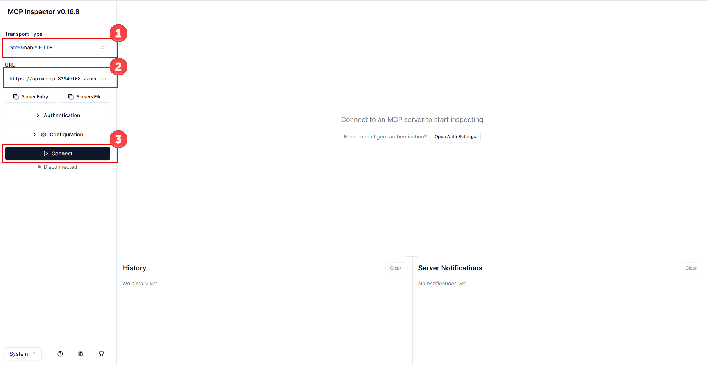
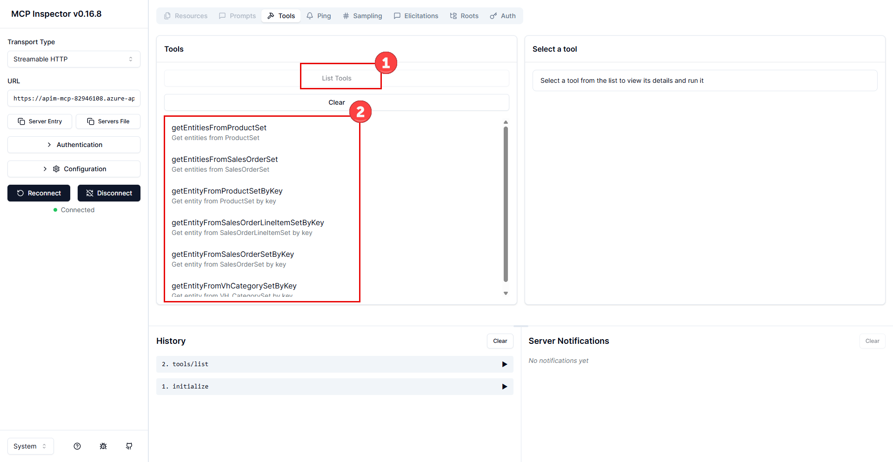
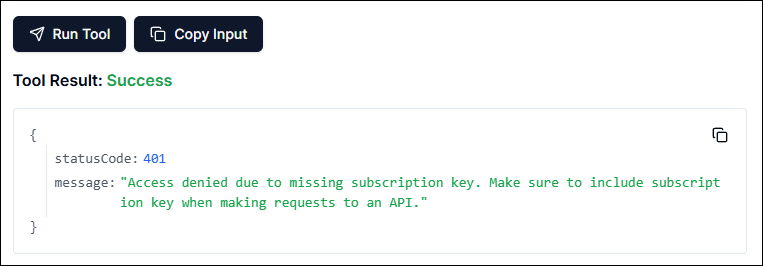
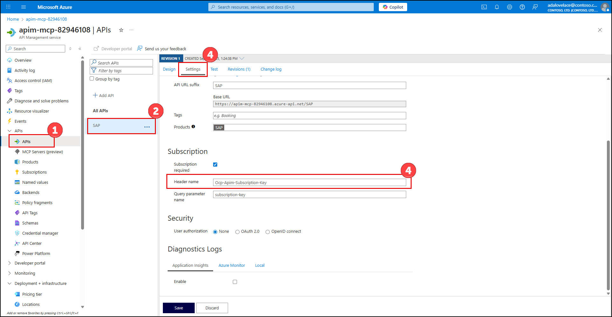
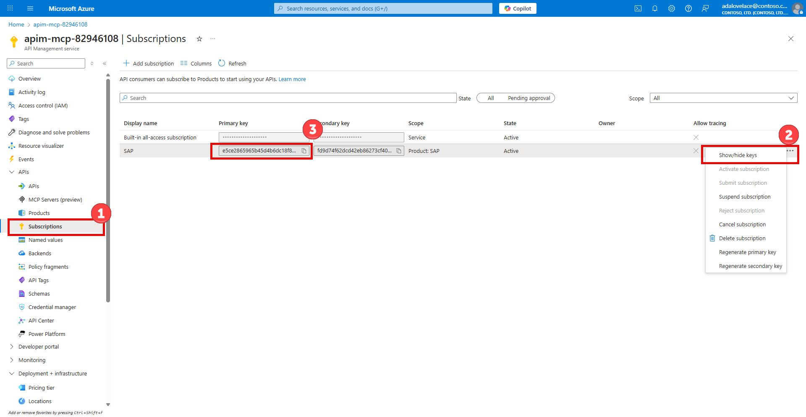
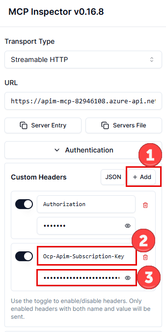
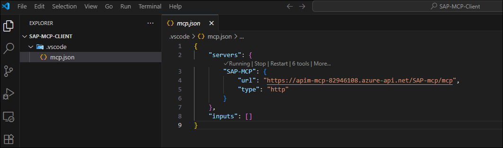
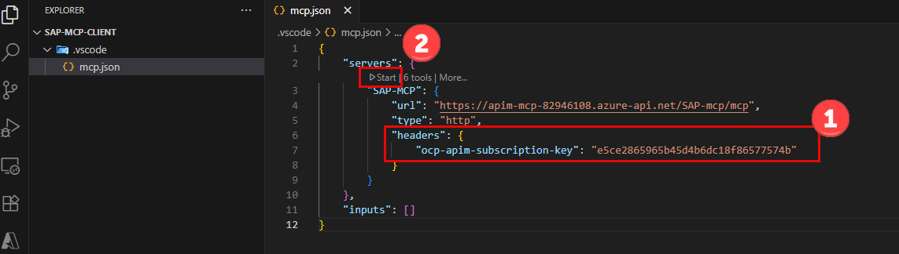
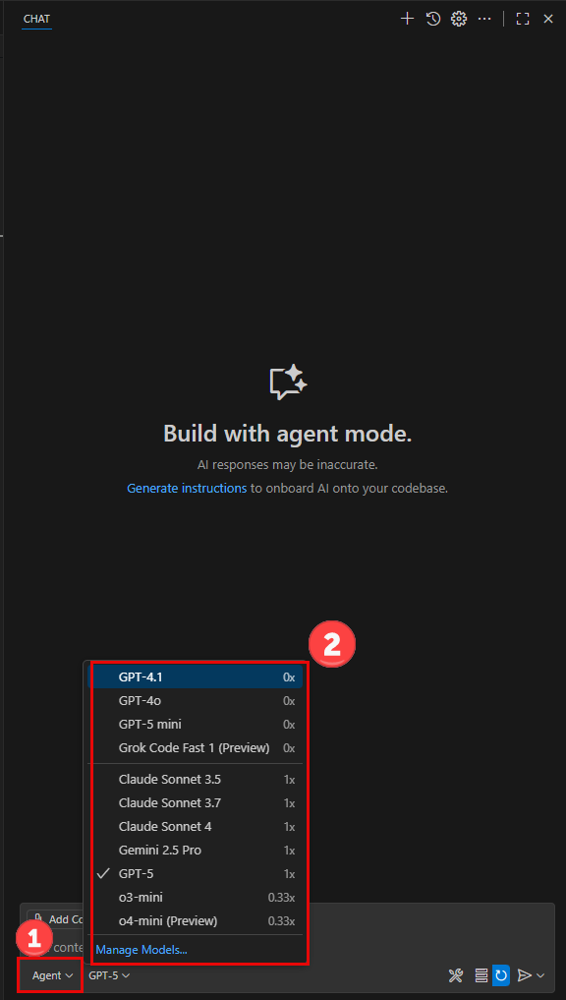

# Exercise 5: Test and use the MCP server

In this exercise, you will test and use the MCP server using the MCP Inspector and also through an MCP client app like Visual Studio Code with GitHub Copilot.

## Objectives

After completing this exercise, you will be able to:

- Test the MCP server using the MCP Inspector
- Test the MCP server using Visual Studio Code

## Duration

**Estimated time:** 10 - 15 minutes

===

# Task 01: Test the MCP Server using the MCP Inspector

## Introduction

MCP Inspector is a tool designed for the Model Context Protocol (MCP) ecosystem, primarily used for testing and debugging MCP servers, clients, and related components, especially during local development.

## Description

In this task, you will execute the `npx` command to launch the MCP Inspector, and configure the settings to reach the MCP Server to test the accessibility and correct responses from the MCP Server to valid its purpose.

## Success Criteria

- Connecting to the MCP Server from the MCP Inspector is successful.
- Testing a `GET` tool returns valid data from the SAP system.

## Learning resources

[MCP Inspector Documentation](https://modelcontextprotocol.io/docs/tools/inspector)

## Key Tasks

1. [] Make sure `Node.js` is installed on the machine. if it is not installed, download it from the official [nodejs.org](https://nodejs.og) web site using a Windows Installer for the LTS (Long Term Support).  The install will maker sure that `node`, `npm` and `npx` all work locally on the machine.  To verify run the following commands from the command to make sure they are all installed and working:

    ```bash
    node -v
    npm -v
    npx -v
    ```

2. [] Open your API Management resource in the Azure portal and pick the MCP Servers under APIs in the left panel

    

3. [] Choose your MCP Server that you have already configured and take note of the MCP server URL ( copy it to the clipboard) we are going to use it in the next steps.

    

4. [] Run the MCP Inspector directly on the machine without requiring installation by executing the following command:

    ```bash
    npx @modelcontextprotocol/inspector
    ```

5. [] Your default browser will open the MCP Inspector locally on your machine

    

6. [] Pick `Streamable HTTP` from the Transport Type drop down

7. [] Paste the URL you copied from step 3 above in the URL text box and click `connect`

8. [] Once you connect successfully, click on `List Tools` in the Tools Window section

    

9. [] Click on the `getEntitiesFromProductSet` tool, set the `$top` paranmeter to `5`, the `$format` parameter to `json` and click on the `Run Tool` button at the bottom

10. [] Notice the error 401 in the response, as access is denied. The reason for that error is the fact that we set a secure subscription on the MCP Server in the API Management resource.

    

11. [] Head back over to the API Management resource in the Azure Portal and open the APIs panel on the Settings page to copy the `Header Name` we will need in the inspector.  It is called `Ocp-Apim-Subscription-Key`

    

12. [] Now head to the `Subscription` panel in the API management portal resource, click on the elipsis next to your subscription name to `Show` the keys and copy the primary key to the clipboard.

    

13. [] Now we can head back to the MCP Inspector and add the authentication properly. Click on `+ Add` for Custom headers under Authentication and add a header called `Ocp-Apim-Subscription-Key` and the value is what you saved as a the preimary key from the previous step.

    > [!IMPORTANT]
    > You have to `Disconnect` and then `reconnect` for the change to take effect in the MCP Inspector.

    

14. [] Run the previous test again with $top 5 and $format json and you should see a successful execution

    

# Task 02: Test the MCP Server using Visual Studio Code

## Introduction

In Visual Studio Code, MCP servers add tools for tasks to allow for interacting with external APIs like our SAP MCP Server.

## Description

In this task, you will use `Visual Studio Code` as an MCP Client to allow the GitHub Copilot in Agent Mode to access the SAP MCP Server we created and ask questions about your SAP Data in the Chat window.

## Success Criteria

- Add the SAP MCP Server to your Visual Studio Code Workspace and see all the tools available in the Chat Window configuration.
- In Natural Language, ask questions about your SAP system and receive valid responses in the Chat Window.

## Learning resources

[Visual Studio Code MCP Server use](https://code.visualstudio.com/docs/copilot/customization/mcp-servers)

## Key Tasks

1. [] Open Visual Studio Code and create a new empty folder and open that folder in the IDE.  You can call the folder any name.

2. [] `CTRL-SHIFT-P` to open the Command Plalette.  Find the comand for `MCP: Add Server...`

3. [] Use the `HTTP` transport option

4. [] Paste the URL of your MCP server that we created in API Management resource.  It looks something like this `https://apim-mcp-xxxxxxxx.azure-api.net/SAP-mcp/mcp`

5. [] Give your Visual Studio Code MCP Server reference a name, something like `SAP-MCP`

6. [] Finally choose Workspace insatead of Global to create the `mcp.json` file locally to the folder you created earlier.

7. [] Visual Studio Code will present a dialog to TRUST the MCP server, click on Trust.

    

8. [] Now manually enter an authentication key to the `mcp.json` file by adding a key called `headers` which include a sub key called `ocp-apim-subscription-key` and its value is the same we used from the MCP Inspector exercise.  Or you can just get it from the API Management Resource in the Azure Portal under `Subscriptions`.  click on the `start` helper above the Server name in the `mcp.json` fiel to start the MCP server as shown below.

    

9. [] Open the Chat window of the GitHub Copilot in Visual Studio Code, make sure you are in `Agent` mode and pick whatever LLM you would like to experiemnt with.

    

10. [] Ask questions about the SAP products, categories and orders and see if Copilot is able to figure out that your MCP server should be called and formulate an input to get a response before sending to the LLM.  For example start by asking: `What are the last 5 orders by Asia High tech`.  You will notice that the LLM will correctly pick the tool `getEntitiesFromSalesOrderSet` and will ask permission for you to allow the LLM to call that tool.

    

11. [] After allow the function call to proceed, you will be presented with the correct last 5 orderes for the company `Asia High Tech`

    

12. [] Continue with the conversation and ask for more information about the 3rd order # `0500009829` by asking `Give me more information about order 0500009829` and see the response and the new tool that was chosen to get the order by key

    

The power of your SAP system at the fingertips of your Business Analysts.
